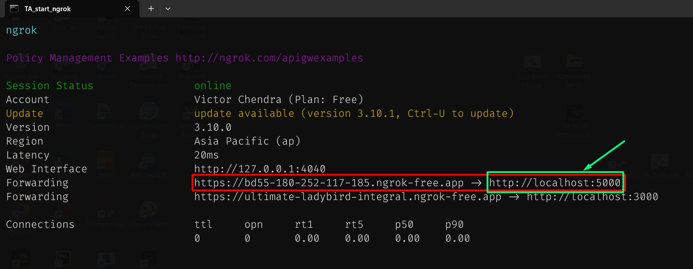

# Final Project Application


-----

## A. Initialize

### 1. Flask API (Python 3.10.2)
```bat
cd flask-backend
python -m venv env
env\Scripts\activate
pip install -r requirements.txt

```

### 2. Vuetify
```bat
cd vuetify-frontend
pnpm install

```

-----

## B. How to run
Prepare 2 `cmd`

### 1. Python Flask (Back-end API)

Open `cmd`, then paste this:

```bat
flask-backend\env\Scripts\activate
cd flask-backend\package
flask --debug run

```

### 2. Web Application (Front-end)

Open `cmd`, then paste this:

```bat
cd vuetify-frontend
pnpm run dev

```


## C. Using `ngrok` (for hosting)

- ngrok file path: `C:\ngrok\ngrok.exe`
- config yml file: `C:\Users\username\AppData\Local\ngrok\ngrok.yml`

Copy this code below to your config `.yml` file:

```yml
version: "2"
authtoken: 2JI0tEYSetFGxyAnem996cYHNPy_32LDpKZHy5NcdcnEoCoSd  # Adjust this
tunnels:
    frontend:
        proto: http
        addr: 3000
        host_header: rewrite
        domain: (you can ignore this)  # ultimate-ladybird-integral.ngrok-free.app
    backend:
        proto: http
        addr: 5000
        host_header: rewrite
        schemes:
            - https
        response_header:
            add:
                - "Access-Control-Allow-Methods: *"
                - "Access-Control-Allow-Headers: *"

```

LAST STEP:<br>
> Copy the fowarded backend port link. <br> 
For example in this picture below (https://bd55-180-252-117-185.ngrok-free.app)



> Paste it in `axios.js` like this below:


Open `ngrok` then paste this to run:
```bat
ngrok start frontend backend
```

Or simply to start, execute the `start_ngrok.bat`

And Done!
